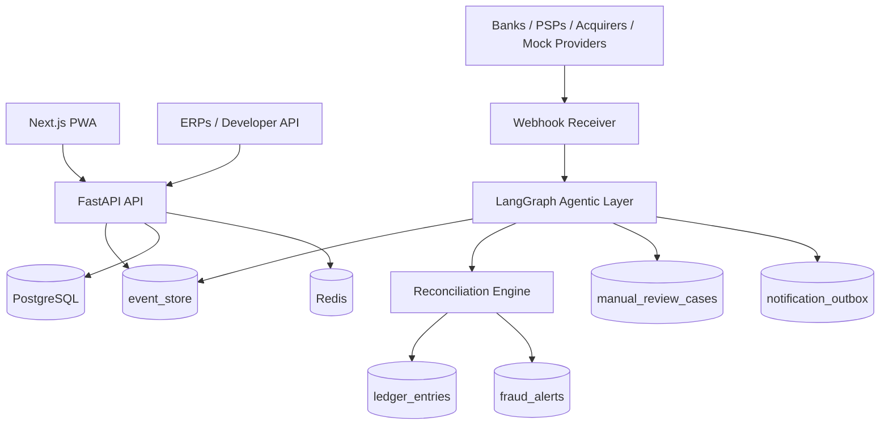

# PixOps OS

**Real-Time Payment Operations, Reconciliation & Anti-Fraud Platform**

PixOps OS is a real-time payment operations platform for Brazilian businesses, connecting Pix, banks, card machines, PSPs and acquirers into a unified event-driven ledger for reconciliation, fraud detection and financial intelligence.

Em portugues: PixOps OS e um sistema operacional de pagamentos em tempo real para empresas brasileiras, conectando Pix, bancos, maquininhas, PSPs e adquirentes em um ledger orientado a eventos para conciliacao, antifraude e inteligencia financeira.

## Languages

- [Portugues (Brasil)](README.pt-BR.md)
- [English](README.en.md)
- [Espanol](README.es.md)
- [Francais](README.fr.md)

## Problem

Brazilian businesses often receive payments through fragmented channels: Pix, QR Code, copia e cola, card terminals, online card payments, payment links, boletos, bank transfers, PSPs, gateways and acquirers. Operational teams still depend on screenshots, manual checks and disconnected bank/acquirer portals.

PixOps OS addresses this by making every important financial event traceable, auditable and reconcilable before a sale is treated as paid.

## Core Principle

- Sem evento validado, sem venda liberada.
- Sem reconciliacao, sem status `paid`.
- Sem ledger, sem confirmacao final.
- Sem trace, sem decisao de agente.

## MVP Capabilities

- Multi-tenant setup for tenants, companies, stores, operators and cash registers.
- Mocked dynamic Pix charge with `txid`, QR Code payload and copia e cola.
- Webhook receiver with raw payload storage, signature validation and idempotency.
- Append-only Event Store with hash chain.
- Reconciliation Engine for expected sale vs received payment.
- Double-entry ledger for matched payments.
- Fraud alerts for mismatches, orphan payments, invalid webhooks and manual release attempts.
- LangGraph/LangChain agentic layer for analysis, routing, timeout detection, notification and manual review.
- Notification outbox and manual review cases.
- Dashboard, event monitor, ledger and fraud center.

## Architecture



## Stack

- Frontend: Next.js, TypeScript, TailwindCSS, PWA-ready.
- Backend: FastAPI, SQLAlchemy 2.x, Alembic, Pydantic.
- Data: PostgreSQL, Redis.
- Events: append-only `event_store` with tamper-evident hash chain.
- Agents: LangGraph, LangChain, LangSmith-ready tracing.
- Observability: OpenTelemetry-ready, Prometheus/Grafana/Loki/Tempo-ready docs.

## Run Locally

```bash
docker compose up --build
```

- Web: `http://localhost:3000`
- API: `http://localhost:8000`
- Swagger/OpenAPI: `http://localhost:8000/docs`

## Environment

Backend environment template: `services/api/.env.example`

Important variables:

- `DATABASE_URL`
- `REDIS_URL`
- `JWT_SECRET_KEY`
- `MASTER_API_KEY`
- `WEBHOOK_ALLOWED_IPS`
- `LANGCHAIN_TRACING_V2`
- `LANGCHAIN_API_KEY`
- `LANGCHAIN_PROJECT`
- `AGENT_TIMEOUT_MINUTES`

## Demo Flows

See [docs/demo-flows.md](docs/demo-flows.md).

The intended demo covers:

1. Create a sale.
2. Generate mocked Pix charge.
3. Simulate approved webhook.
4. See sale become paid after verified event, reconciliation and ledger.
5. Simulate amount mismatch.
6. See fraud alert and manual review.
7. Run timeout watchdog.
8. See blocked sale, notification and manual review case.

## Documentation

- [Architecture](docs/architecture.md)
- [Architecture Audit](docs/architecture-audit.md)
- [Agentic Architecture](docs/agentic-architecture.md)
- [Multi-cloud Architecture](docs/multi-cloud-architecture.md)
- [Event Catalog](docs/event-catalog.md)
- [Database Model](docs/database-model.md)
- [Reconciliation Engine](docs/reconciliation-engine.md)
- [Provider Adapters](docs/provider-adapters.md)
- [Security](docs/security.md)
- [Observability](docs/observability.md)
- [Roadmap](docs/roadmap.md)

## Regulatory Disclaimer

PixOps OS is not a bank, PSP, acquirer, payment institution or direct Pix participant. It is a software layer for payment operations, reconciliation, event tracking, fraud monitoring and financial intelligence. Real production integrations must be performed through authorized banks, PSPs, acquirers, gateways or regulated providers.

O PixOps OS nao e banco, PSP, adquirente, instituicao de pagamento ou participante direto do Pix. Ele e uma camada de software para operacao de pagamentos, conciliacao, rastreamento de eventos, monitoramento antifraude e inteligencia financeira. Integracoes reais em producao devem ser feitas por bancos, PSPs, adquirentes, gateways ou provedores autorizados.

## Anti-fraud Disclaimer

PixOps OS is designed to reduce operational fraud, fake receipt fraud, human error and reconciliation failures. It does not promise to prevent 100% of fraud.

## Roadmap

- Queue-backed webhook processing with Redis Streams, RabbitMQ, NATS or Kafka/Redpanda.
- Real provider adapters for authorized Pix/bank/PSP/acquirer integrations.
- Open Finance consent, payment initiation and account information adapters.
- Stronger provider credential encryption with KMS/Vault.
- Prometheus metrics and Grafana dashboards for payment operations.
- Expanded automated tests for all critical demo flows.
