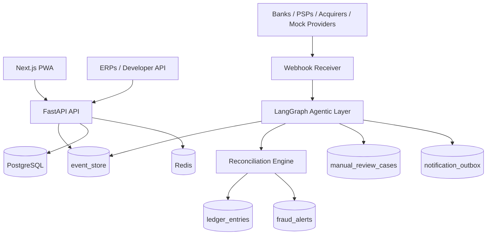

<div align="center">

<br/>

```
██████╗ ██╗██╗  ██╗ ██████╗ ██████╗ ███████╗     ██████╗ ███████╗
██╔══██╗██║╚██╗██╔╝██╔═══██╗██╔══██╗██╔════╝    ██╔═══██╗██╔════╝
██████╔╝██║ ╚███╔╝ ██║   ██║██████╔╝███████╗    ██║   ██║███████╗
██╔═══╝ ██║ ██╔██╗ ██║   ██║██╔═══╝ ╚════██║    ██║   ██║╚════██║
██║     ██║██╔╝ ██╗╚██████╔╝██║     ███████║    ╚██████╔╝███████║
╚═╝     ╚═╝╚═╝  ╚═╝ ╚═════╝ ╚═╝     ╚══════╝     ╚═════╝ ╚══════╝
```

**Real-Time Payment Operations, Reconciliation & Anti-Fraud Platform**

*No validated event. No paid sale. No exceptions.*

<br/>

[](https://python.org)
[](https://fastapi.tiangolo.com)
[](https://nextjs.org)
[](https://postgresql.org)
[](https://redis.io)
[](https://langchain-ai.github.io/langgraph)
[](LICENSE)

<br/>

[**Português (Brasil)**](README.pt-BR.md) · [**English**](README.en.md) · [**Español**](README.es.md) · [**Français**](README.fr.md)

<br/>

</div>

---

## The Problem

Brazilian businesses receive payments through fragmented, disconnected channels:

> Pix · QR Code · Copia e Cola · Maquininhas · Links de Pagamento · Boletos · TEDs · PSPs · Gateways · Adquirentes

**Operational teams still depend on screenshots, manual checks and disconnected portals.**

The result: payment confirmation without validation. Sales released before money actually arrives. Reconciliation done days later — when the damage is already done.

PixOps OS was built to eliminate this gap.

---

## Core Principles

Every design decision in PixOps OS flows from four non-negotiable rules:

```
┌─────────────────────────────────────────────────────────────────┐
│                                                                 │
│   Sem evento validado  →  sem venda liberada.                   │
│   Sem reconciliação    →  sem status paid.                      │
│   Sem ledger           →  sem confirmação final.                │
│   Sem trace            →  sem decisão de agente.                │
│                                                                 │
└─────────────────────────────────────────────────────────────────┘
```

Every payment event is **traceable**, **auditable** and **reconcilable** before a sale changes state.

---

## MVP Capabilities

<table>
<thead>
<tr>
<th>Module</th>
<th>Capability</th>
</tr>
</thead>
<tbody>
<tr>
<td><strong>Multi-Tenancy</strong></td>
<td>Tenants, companies, stores, operators and cash registers with full isolation</td>
</tr>
<tr>
<td><strong>Pix Charges</strong></td>
<td>Mocked dynamic Pix charge with <code>txid</code>, QR Code payload and copia e cola</td>
</tr>
<tr>
<td><strong>Webhook Engine</strong></td>
<td>Raw payload storage, signature validation and idempotency guarantees</td>
</tr>
<tr>
<td><strong>Event Store</strong></td>
<td>Append-only log with tamper-evident hash chain — every event is immutable</td>
</tr>
<tr>
<td><strong>Reconciliation Engine</strong></td>
<td>Expected sale vs. received payment — automated matching with mismatch detection</td>
</tr>
<tr>
<td><strong>Double-Entry Ledger</strong></td>
<td>Accounting-grade ledger entries for every matched payment</td>
</tr>
<tr>
<td><strong>Fraud Alerts</strong></td>
<td>Mismatches, orphan payments, invalid webhooks, manual release attempts</td>
</tr>
<tr>
<td><strong>Agentic Layer</strong></td>
<td>LangGraph/LangChain agents for analysis, routing, timeout detection and notifications</td>
</tr>
<tr>
<td><strong>Manual Review</strong></td>
<td>Structured cases for human-in-the-loop decisions on flagged events</td>
</tr>
<tr>
<td><strong>Dashboard</strong></td>
<td>Event monitor, ledger view, fraud center and operational overview</td>
</tr>
</tbody>
</table>

---

## Architecture



Every payment enters the system as an immutable event. Agents validate, reconcile and route — no human manual intervention required for standard flows.

---

## Stack

| Layer | Technology |
|---|---|
| **Frontend** | Next.js 14 · TypeScript · TailwindCSS · PWA-ready |
| **Backend** | FastAPI · SQLAlchemy 2.x · Alembic · Pydantic v2 |
| **Database** | PostgreSQL 16 · Redis 7 |
| **Event Store** | Append-only table · tamper-evident hash chain |
| **Agents** | LangGraph · LangChain · LangSmith-ready tracing |
| **Observability** | OpenTelemetry · Prometheus · Grafana · Loki · Tempo |

---

## Getting Started

### Prerequisites

- Docker & Docker Compose
- `.env` configured from `services/api/.env.example`

### Run Locally

```bash
git clone https://github.com/your-org/pixops-os.git
cd pixops-os
cp services/api/.env.example services/api/.env
# Configure your variables
docker compose up --build
```

| Service | URL |
|---|---|
| Web App | `http://localhost:3000` |
| API | `http://localhost:8000` |
| Swagger / OpenAPI | `http://localhost:8000/docs` |

---

## Environment Variables

Configure `services/api/.env` before starting:

```env
# Database
DATABASE_URL=postgresql+asyncpg://user:pass@db:5432/pixops
REDIS_URL=redis://redis:6379/0

# Security
JWT_SECRET_KEY=your-secret-key
MASTER_API_KEY=your-master-key
WEBHOOK_ALLOWED_IPS=127.0.0.1,0.0.0.0

# Agents / Tracing
LANGCHAIN_TRACING_V2=true
LANGCHAIN_API_KEY=ls__your-key
LANGCHAIN_PROJECT=pixops-os
AGENT_TIMEOUT_MINUTES=10
```

---

## Demo Flows

The full walkthrough covers the complete payment lifecycle — happy path and failure modes.

> Full details: [`docs/demo-flows.md`](docs/demo-flows.md)

```
1  →  Create a sale
2  →  Generate a mocked Pix charge (txid + QR Code)
3  →  Simulate approved webhook from provider
4  →  Watch the sale become paid after event validation, reconciliation and ledger entry
──
5  →  Simulate an amount mismatch
6  →  Observe fraud alert + automatic manual review case
──
7  →  Run timeout watchdog agent
8  →  Observe blocked sale, outbound notification and review case
```

---

## Documentation

| Document | Description |
|---|---|
| [Architecture](docs/architecture.md) | System design and component overview |
| [Architecture Audit](docs/architecture-audit.md) | Trade-offs, risks and decisions |
| [Agentic Architecture](docs/agentic-architecture.md) | LangGraph agents, nodes and routing logic |
| [Multi-cloud Architecture](docs/multi-cloud-architecture.md) | AWS / GCP / Azure deployment topology |
| [Event Catalog](docs/event-catalog.md) | All domain events and their schemas |
| [Database Model](docs/database-model.md) | Entity-relationship model and schema |
| [Reconciliation Engine](docs/reconciliation-engine.md) | Matching logic, rules and edge cases |
| [Provider Adapters](docs/provider-adapters.md) | Integration layer for PSPs, banks and acquirers |
| [Security](docs/security.md) | Authentication, authorization and threat model |
| [Observability](docs/observability.md) | Metrics, traces, logs and alerting |
| [Roadmap](docs/roadmap.md) | Upcoming features and priorities |

---

## Roadmap

- [ ] Queue-backed webhook processing — Redis Streams · RabbitMQ · NATS · Kafka / Redpanda
- [ ] Real provider adapters for authorized Pix, bank, PSP and acquirer integrations
- [ ] Open Finance — consent flows, payment initiation and account information adapters
- [ ] Provider credential encryption via KMS / Vault
- [ ] Prometheus metrics and Grafana dashboards for payment operations
- [ ] Expanded automated test coverage for all critical demo flows

---

## Disclaimers

<details>
<summary><strong>Regulatory Disclaimer</strong></summary>

<br/>

PixOps OS is **not** a bank, PSP, acquirer, payment institution or direct Pix participant.

It is a software layer for payment operations, reconciliation, event tracking, fraud monitoring and financial intelligence. Real production integrations must be performed through authorized banks, PSPs, acquirers, gateways or regulated providers.

---

*PixOps OS não é banco, PSP, adquirente, instituição de pagamento ou participante direto do Pix. Ele é uma camada de software para operação de pagamentos, conciliação, rastreamento de eventos, monitoramento antifraude e inteligência financeira. Integrações reais em produção devem ser feitas por bancos, PSPs, adquirentes, gateways ou provedores autorizados.*

</details>

<details>
<summary><strong>Anti-Fraud Disclaimer</strong></summary>

<br/>

PixOps OS is designed to reduce operational fraud, fake receipt fraud, human error and reconciliation failures.

It does not promise to prevent 100% of fraud.

</details>

---

<div align="center">

<br/>

*Built for Brazilian payment operations teams who can't afford to guess.*

<br/>

</div>
