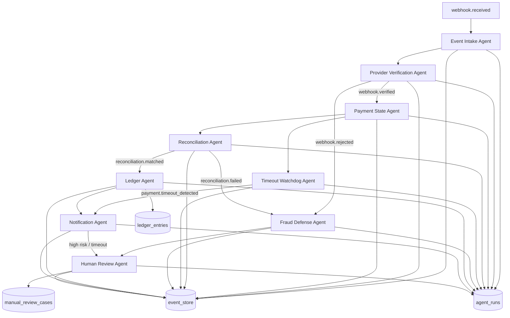

# Agentic Architecture

## Objective
Agentic Payment Operations Layer for PixOps OS, built with LangGraph + LangChain, to investigate, classify, reconcile, notify, and escalate payment operations events without autonomously confirming payment.

Core enforcement:
- Sem evento validado, sem venda liberada.
- Sem reconciliação, sem status `paid`.
- Sem ledger, sem confirmação final.
- Sem trace (`correlation_id`, `causation_id`, `trace_id`), sem decisão de agente.

## Mermaid

## Agent Table
| Agent | Main input | Main output | Responsibility |
|---|---|---|---|
| Event Intake Agent | Any routed event | `event.classified` | Classify event and identify context (`tenant_id`, provider, sale/payment intent). |
| Provider Verification Agent | `webhook.received` | `webhook.verified` or `webhook.rejected` | Validate signature/idempotency/external ID/provider origin. |
| Payment State Agent | `webhook.verified` | `payment.state_checked` | Read-only evaluation of current payment intent state. |
| Reconciliation Agent | `payment.state_checked` | `reconciliation.matched` or `reconciliation.failed` | Compare expected vs received (amount, txid/references). |
| Ledger Agent | `reconciliation.matched` | `ledger.entry.created` | Create ledger entries and mark sale/payment intent as paid. |
| Fraud Defense Agent | `reconciliation.failed`, `webhook.rejected` | `fraud.alert.created` | Risk scoring and fraud alert creation. |
| Timeout Watchdog Agent | `payment.awaiting_confirmation` | `payment.timeout_detected` or wait state | Monitor pending intents and block release after due time. |
| Notification Agent | timeout, ledger, fraud contexts | `notification.sent` or `notification.failed` | Notify dashboard/PWA/email/webhooks; "não libere a venda". |
| Human Review Agent | `fraud.alert.created` or timeout escalation | `manual_review_case.created` | Open manual case with timeline and recommendation. |
| Report Agent | `cashier.session.closed` | `ai.summary.generated` | Operational/day-end summary and closure support. |

## Router
- `webhook.received` -> Provider Verification Agent
- `webhook.verified` -> Payment State Agent
- `payment.state_checked` -> Reconciliation Agent
- `reconciliation.matched` -> Ledger Agent
- `reconciliation.failed` -> Fraud Defense Agent
- `payment.awaiting_confirmation` -> Timeout Watchdog Agent
- `payment.timeout_detected` -> Notification Agent
- `fraud.alert.created` -> Human Review Agent
- `ledger.entry.created` -> Notification Agent + Dashboard update
- `cashier.session.closed` -> Report Agent

## Transaction States
- `created`
- `awaiting_payment`
- `paid`
- `expired`
- `failed`
- `suspicious`
- `timeout`

Reconciliation classifications:
- `matched`
- `underpaid`
- `overpaid`
- `orphan_payment`
- `duplicate`
- `late_payment`
- `pending`

## Timeout Rules
- Every Pix charge schedules a watchdog task (`agent_tasks`) with `due_at`.
- If provider-confirmed event arrives before `due_at`, reconciliation flow proceeds.
- If no valid confirmation before `due_at`, watchdog emits `payment.timeout_detected`.
- Timeout enforces blocked release and escalation path (`notification_outbox` + `manual_review_cases`).

## Notification Rules
- Operator alert: always on timeout or suspicious path ("não libere a venda").
- Owner/manager alert: medium/high/critical risk.
- Delivery channels in MVP: dashboard + email outbox (extensible to push, WhatsApp, SMS, external webhook).
- Retries and delivery status tracked in `notification_outbox`.

## Human In The Loop
- Manual case created for fraud, mismatch, orphan, invalid webhook, and timeout escalation.
- Case data includes: sale/payment context, event correlation, recommendation, severity.
- Actions supported: resolve, escalate, ignore, request recheck.
- Actions are auditable via `event_store` and `audit_events`.

## LangGraph/LangChain/LangSmith
- Orchestration via `StateGraph` with conditional edges.
- Streaming updates enabled via `graph.stream(..., stream_mode="updates")`.
- Execution metadata includes:
  - `tenant_id`
  - `correlation_id`
  - `causation_id`
  - `trace_id`
  - `sale_id`
  - `payment_intent_id`
  - `provider`
  - `environment`
- LangSmith-ready config:
  - `LANGCHAIN_TRACING_V2`
  - `LANGCHAIN_API_KEY`
  - `LANGCHAIN_PROJECT`
- Checkpointer: Postgres preferred, memory fallback for local/dev resilience.

## OpenTelemetry Integration
- HTTP route traces for intake and agent endpoints.
- Webhook processing traces with correlation metadata.
- Async watchdog run metrics:
  - processing lag
  - timeout rate
  - reconciliation match rate
  - duplicate webhook rate
- Structured logs without leaking secrets/PII.

## Cloud Reference Architectures
### AWS
- EventBridge + SQS FIFO + Step Functions + RDS PostgreSQL + ECS/Fargate.

### Google Cloud
- Pub/Sub + Eventarc + Workflows + Cloud Run + Cloud SQL PostgreSQL.

### Azure
- Event Grid + Service Bus + Durable Functions + Container Apps + Azure Database for PostgreSQL.
