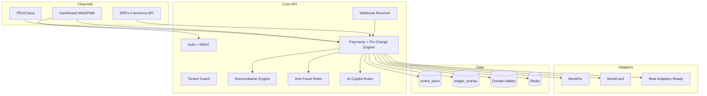

# Architecture

## Context
PixOps OS opera como camada operacional acima de bancos/PSPs/adquirentes.

## Mermaid

## Design Notes
- Event sourcing simplificado: eventos financeiros principais no `event_store`.
- Ledger orientado a double-entry quando pagamento é confirmado.
- Multi-tenant por `tenant_id` em todas as consultas de domínio.
- `webhook_events` armazena payload bruto antes do processamento.
