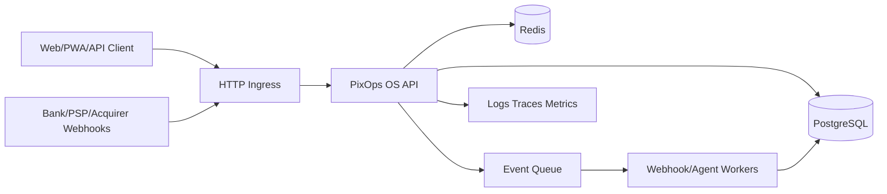

# Multi-cloud Architecture

PixOps OS must remain cloud-agnostic in code. Cloud services should be adapters around HTTP ingress, queues, traces, metrics, storage and secrets. Business rules stay in `services/api`.

## Reference Flow

## AWS

- Ingress: API Gateway or Application Load Balancer.
- Compute: ECS/Fargate for API and workers; Lambda only for narrow async handlers.
- Events: EventBridge for domain events.
- Queue: SQS FIFO for webhook and reconciliation jobs requiring ordering/idempotency.
- Workflow: Step Functions for long-running operational workflows.
- Database: RDS PostgreSQL.
- Cache: ElastiCache Redis.
- Observability: CloudWatch, X-Ray/OpenTelemetry collector.
- Secrets: AWS Secrets Manager or SSM Parameter Store.

## Google Cloud

- Compute: Cloud Run for API and workers.
- Events: Pub/Sub and Eventarc.
- Workflow: Workflows for orchestrated timeout/review flows.
- Database: Cloud SQL PostgreSQL.
- Cache: Memorystore Redis.
- Observability: Cloud Logging, Cloud Trace, Cloud Monitoring.
- Secrets: Secret Manager.

## Azure

- Compute: Azure Container Apps for API/workers; Azure Functions for narrow event handlers.
- Events: Event Grid for domain notifications.
- Queue: Service Bus for webhook processing, reconciliation and outbox jobs.
- Workflow: Durable Functions for timeout/human-review workflows.
- Database: Azure Database for PostgreSQL.
- Cache: Azure Cache for Redis.
- Observability: Application Insights and Azure Monitor.
- Secrets: Azure Key Vault.

## Portability Rules

- Do not call cloud SDKs from payment domain services.
- Wrap queues, object storage, secrets and telemetry behind interfaces.
- Keep event names and payload schemas cloud-neutral.
- Use `tenant_id`, `correlation_id`, `causation_id` and `trace_id` across providers.
- Use infrastructure folders/templates per cloud, not conditional business code.
